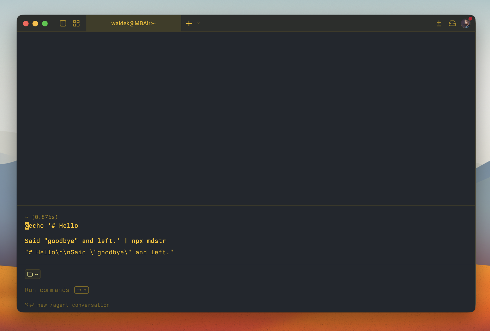

# mdstr

[](https://skills.sh/waldekmastykarz/mdstr)

Convert markdown to a JSON-safe string. One command. Zero config.

```sh
echo '# Hello

Said "goodbye" and left.' | mdstr
# → "# Hello\n\nSaid \"goodbye\" and left."
```



## Use with AI agents

Give your AI coding agent the mdstr skill so it can convert markdown to JSON-safe strings on your behalf:

```sh
npx skills add waldekmastykarz/mdstr
```

Once installed, ask your agent to _"convert this markdown to a JSON string"_ or _"escape this markdown for JSON"_ and it will handle the rest.

## Why

You have markdown. You need it inside JSON — for an API call, an LLM prompt, a config file. `JSON.stringify` handles the escaping, but getting there from a file or stdin is friction. `mdstr` removes it.

**Before:**

```sh
node -e "process.stdout.write(JSON.stringify(require('fs').readFileSync('README.md','utf-8').replace(/\n$/,'')))"
```

**After:**

```sh
mdstr README.md
```

## Install

```sh
npm install -g mdstr
```

Or use directly with `npx` — no install needed:

```sh
npx mdstr README.md
```

## Usage

### From a file

```sh
mdstr README.md
mdstr ./docs/guide.md
```

### From stdin

```sh
cat notes.md | mdstr
echo '# "Hello" World' | mdstr
# → "# \"Hello\" World"
```

### Keep trailing newline

By default, `mdstr` strips the trailing newline. To keep it:

```sh
mdstr README.md --preserve-newline
```

### Embed in JSON

The output is a valid JSON string (with surrounding quotes), ready to drop into any JSON structure:

```sh
jq -n --argjson content "$(mdstr instructions.md)" '{prompt: $content}' > payload.json
```

## Options

| Flag | Description |
|---|---|
| `--preserve-newline` | Keep trailing newline in output |
| `--version` | Show version number |
| `--help` | Show help with examples |

## Exit codes

| Code | Meaning |
|---|---|
| `0` | Success |
| `1` | Read/conversion error |
| `2` | Invalid usage (file not found, no input) |

### Use with AI agents in automated pipelines

`mdstr` is built to work in automated pipelines and agent tool calls. Predictable output, explicit exit codes, no interactive prompts.

### Inject markdown into LLM prompts

```sh
SYSTEM_PROMPT=$(mdstr system-prompt.md)
curl -s https://api.openai.com/v1/chat/completions \
  -H "Content-Type: application/json" \
  -H "Authorization: Bearer $OPENAI_API_KEY" \
  -d "$(jq -n --argjson prompt "$SYSTEM_PROMPT" '{
    model: "gpt-4o",
    messages: [{role: "system", content: $prompt}]
  }')"
```

### Pipe markdown into JSON

```sh
echo '- line 1
- line 2' | mdstr | jq '{content: .}'
# → {"content": "- line 1\n- line 2"}
```

### Build payloads from multiple files

```sh
jq -n \
  --argjson system "$(mdstr system.md)" \
  --argjson user "$(mdstr user-prompt.md)" \
  '{messages: [{role: "system", content: $system}, {role: "user", content: $user}]}'
```

The output is always:
- A single JSON string on stdout (with surrounding quotes)
- Errors on stderr
- Deterministic exit codes

No confirmation prompts. No color codes. No spinners.

## Requirements

Node.js >= 20

## License

[MIT](LICENSE)